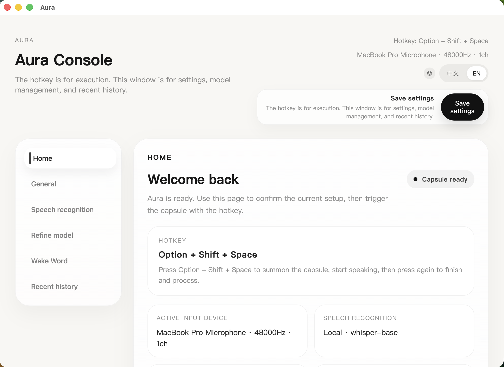
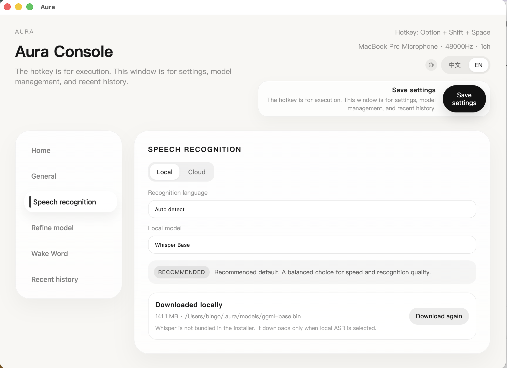
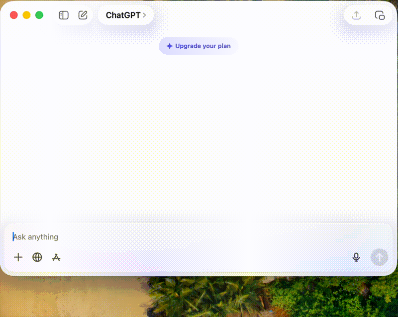

<p align="center">
  
</p>

# Aura - Intelligent Voice Refinement Engine

[中文文档](README-zh.md)

Aura is an open-source, free, privacy-first voice refinement tool. Its core experience is the capsule: press a hotkey to record, press again to finish, then Aura transcribes and refines your speech and inserts the result into the active input field (or falls back to clipboard).

Aura is inspired by the Typeless interaction model, but built independently with its own implementation and product identity.





## Highlights

- **Fast capture**: One hotkey to start, one to finish
- **Intelligent refinement**: Transforms spoken drafts into polished, structured text ready to use
- **Auto insert**: Writes directly into the focused input field or clipboard
- **Multi-language support**: Primarily tested with Simplified Chinese and English; other languages depend on model capabilities
- **Local or cloud**: ASR and LLM can run locally or via cloud providers
- **Minimal UI**: Main app is for settings, model management, and history only
- **Multiple output modes**: Notes, emails, reports, and social media formats
- **Resource adaptive**: Automatically selects optimal models based on system resources
- **Cross-platform**: Built with Tauri 2.0 for macOS, Windows, and Linux (Windows/Linux not fully tested yet)

## How It Works

1. **Hotkey**: `Option + Shift + Space` (macOS)
2. **Capsule flow**:
   - First press: Start recording
   - Second press: Stop and process
3. **Processing pipeline**:
   - Audio capture → Speech recognition (ASR) → Denoising → LLM refinement → Structured output
4. **Auto insert**:
   - Cursor in input field → Auto paste
   - Otherwise → Clipboard
5. **Cancel operation**: Press `Esc` to cancel at any time

## Development Setup

```bash
cd aura
npm install
npm run tauri -- dev
```

Quick start:

```bash
./start.sh
```

## Requirements

- **Rust** 1.70+
- **Node.js** 18+
- **ffmpeg** (for audio conversion)
- **Ollama** (only required for local LLM refinement)

### Platform Support

- **macOS**: Fully tested and supported
- **Windows**: Functional but not fully tested
- **Linux**: Functional but not fully tested

> Note: The application is built with Tauri 2.0 and is cross-platform by design. Windows and Linux builds should work, but have not undergone comprehensive testing. Some platform-specific features (like auto-paste) may behave differently.

### Ollama Example

```bash
brew install ollama
ollama serve
ollama pull qwen3.5:2b
```

## Features

### 1. Speech Recognition (ASR)

**Local Options:**
- Whisper models: tiny, base, small, medium, large-v3
- Automatic model download from HuggingFace mirrors
- Primarily tested with Chinese and English; other languages supported based on Whisper capabilities
- Optimized for 16kHz mono audio

**Cloud Providers:**
- OpenAI (Whisper API, GPT-4o transcription)
- Groq (Whisper large-v3-turbo)
- Deepgram (Nova-2)
- AssemblyAI
- Azure Speech Services
- Google Speech-to-Text
- Custom OpenAI-compatible endpoints

### 2. Text Refinement (LLM)

**Processing Pipeline:**
- **Denoising**: Removes filler words ("um", "uh", "那个", "嗯")
- **Context application**: User terminology, name mappings, forbidden words
- **LLM refinement**: Transforms spoken language into polished text
- **Structure detection**: Automatically formats enumerated lists
- **Language normalization**: Converts to Simplified Chinese when applicable

**Local Options:**
- Ollama integration (qwen3.5:2b, llama3.2, gemma3, mistral, etc.)
- Automatic model preloading for faster response
- Resource-aware model selection

**Cloud Providers:**
- OpenAI (GPT-4.1, GPT-4o)
- Anthropic (Claude 3.5 Sonnet, Haiku)
- Google Gemini (1.5 Pro, 2.0 Flash)
- DeepSeek
- Qwen (Alibaba Cloud)
- GLM (Zhipu AI)
- Kimi (Moonshot)
- Minimax
- OpenRouter
- Custom OpenAI-compatible endpoints

### 3. Output Modes

- **Note** (default): Natural, clear text suitable for notes
- **Email**: Concise, professional email body
- **Report**: Structured brief for daily/weekly reports
- **Social**: Social media-friendly short content

### 4. Language Support

**Fully Tested:**
- Simplified Chinese
- English

**Other Languages:**
- Supported based on underlying model capabilities (Whisper for ASR, selected LLM for refinement)
- Not comprehensively tested; functionality may vary
- Language detection and processing depend on model performance

## Settings

The desktop UI provides comprehensive configuration:

- **General**: Interface language (English/Chinese), audio input device
- **Speech Recognition**: Local/cloud routing, provider selection, model configuration
- **Refinement**: LLM provider settings, model selection with recommendations
- **Wake Word**: Enable/disable wake word detection (in development)
- **History**: Paginated view of recent transcriptions and refinements
- **Diagnostics**: Real-time environment health checks for ASR, LLM, delivery, and runtime

### Recommended Models

**Local ASR:**
- **whisper-base**: Recommended default, balanced speed and accuracy (~142MB)
- **whisper-tiny**: Lowest resource usage, suitable for older machines (~75MB)
- **whisper-small**: Higher accuracy, heavier download (~466MB)

**Local LLM:**
- **qwen3.5:2b**: Recommended default, fast and efficient
- **llama3.2:3b**: Good alternative for English
- **gemma3:4b**: Balanced performance

**Cloud ASR:**
- **OpenAI**: gpt-4o-mini-transcribe (fast and affordable)
- **Groq**: whisper-large-v3-turbo (fastest)
- **Deepgram**: nova-2 (high accuracy)

**Cloud LLM:**
- **OpenAI**: gpt-4.1-mini (fast and cost-effective)
- **Anthropic**: claude-3-5-sonnet-latest (highest quality)
- **DeepSeek**: deepseek-chat (excellent Chinese support)

## Auto Insert

**macOS:**
Auto-paste requires Accessibility permission. Without it, Aura falls back to clipboard output.

Enable at: `System Settings → Privacy & Security → Accessibility`

**Windows/Linux:**
Auto-paste behavior may differ from macOS. The application will attempt to paste or fall back to clipboard depending on system capabilities.

## Build & Release

### Build the app

```bash
npm run build
```

### macOS release build

```bash
./build-release.sh
```

Primary output:
- `Aura-macos-universal.dmg`

### macOS signing & notarization

For public distribution, configure Apple Developer certificates and follow:

- `RELEASE_CHECKLIST.md`
- `build-release.sh`

## Project Structure

```
aura/
├── src/                    # Frontend (React + TypeScript)
│   ├── App.tsx            # Main application component
│   ├── components/        # UI components
│   └── assets/            # Frontend assets
├── src-tauri/             # Backend (Rust)
│   ├── src/
│   │   ├── asr/          # Speech recognition module
│   │   ├── llm/          # LLM client
│   │   ├── processing/   # Text processing (denoising)
│   │   ├── storage/      # Data storage
│   │   ├── learning/     # Learning and correction
│   │   ├── core.rs       # Core refinement engine
│   │   ├── models.rs     # Data models
│   │   ├── settings.rs   # Configuration management
│   │   └── lib.rs        # Tauri commands
│   ├── icons/            # Application icons
│   └── Cargo.toml        # Rust dependencies
├── scripts/               # Release tooling scripts
├── package.json          # Node.js dependencies
└── README.md             # Project documentation
```

### Core Architecture

**Frontend (React + TypeScript):**
- Capsule UI state management
- Settings interface and history view
- Audio recording (WebRTC)
- Real-time audio level visualization

**Backend (Rust + Tauri):**
- **ASR Engine**: Local Whisper and cloud API integration
- **LLM Client**: Ollama and multi-cloud provider support
- **Core Engine**: Denoising → Context application → LLM refinement → Structuring
- **Storage Layer**: SQLite (user context) + LanceDB (vector retrieval)
- **System Integration**: Global shortcuts, Accessibility API, clipboard

## Technology Stack

- **Frontend**: React 19, TypeScript, Vite
- **Backend**: Rust, Tauri 2.0
- **Speech Recognition**: whisper-rs, cloud APIs
- **LLM**: Ollama, OpenAI, Anthropic, Gemini, etc.
- **Audio Processing**: cpal, hound, ffmpeg
- **Database**: rusqlite, LanceDB
- **System APIs**: macOS Accessibility, Core Graphics

## Roadmap

**Current (v0.1.0):**
- ✅ End-to-end voice flow
- ✅ Local + cloud dual stack
- ✅ Typeless-style capsule interaction
- ✅ Multiple output modes
- ✅ Resource-adaptive model selection

**Planned:**
- 🔄 Wake word real-time listening
- 🔄 Comprehensive Windows and Linux testing
- 🔄 Enhanced provider auto-detection
- 🔄 User context and correction memory (personalization features)
- 🔄 Additional output modes and scenarios
- 🔄 Multi-language testing and optimization

## License

MIT

## Contributing

Issues and Pull Requests are welcome!

## Acknowledgments

- Inspired by: Typeless
- Speech recognition: OpenAI Whisper
- LLM support: Ollama, OpenAI, Anthropic, and more
